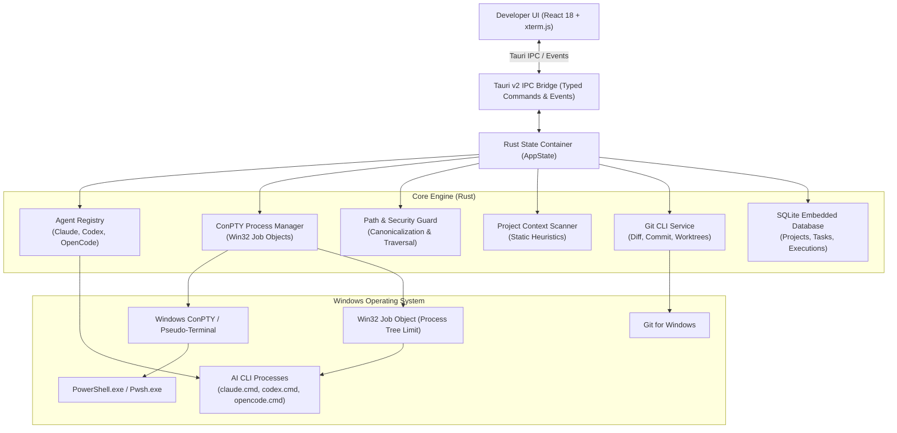

# System Architecture — AI Code Orchestrator (Windows V1)

## Overview

AI Code Orchestrator is designed as a secure, local-first Windows desktop application that bridges multiple AI coding CLIs with developers' local workspaces.

---

## Architectural Principles

1. **Privilege Separation**:
   - The frontend (React / TypeScript) executes strictly inside a sandboxed WebView2 container.
   - The frontend **never** runs arbitrary shell commands directly.
   - All filesystem, process, Git, and database operations execute within the native Rust layer via typed Tauri IPC invocations.

2. **Windows-Native Process Containment**:
   - Spawning terminal sessions utilizes Windows ConPTY (`portable-pty` on Windows).
   - All child processes spawned by tasks or terminals are assigned to a **Win32 Job Object** with `JOB_OBJECT_LIMIT_KILL_ON_JOB_CLOSE`. When a session is terminated or the app exits, the entire process hierarchy is terminated automatically by the Windows kernel without leaving orphan processes.

3. **Pluggable Agent Abstraction**:
   - No tight coupling to any single AI vendor.
   - Claude Code, Codex, and OpenCode implement the unified `AgentAdapter` trait.
   - Adding future agents (e.g. Gemini CLI, Ollama, custom enterprise CLI) requires implementing one trait without modifying the core task execution pipeline.

4. **Security & Path Validation**:
   - Canonicalizes Windows paths (resolving `..`, junctions, drive letters, and symlinks).
   - Rejects any file access escaping the target project workspace root.
   - Sensitive files (`.env*`, private SSH keys, cloud credentials) are excluded from project context scans.

5. **Local-First Persistence**:
   - Data is stored in embedded SQLite (`rusqlite`) in `%APPDATA%\com.ai.orchestrator.desktop\orchestrator.db`.
   - No external cloud services or telemetries are required; no plain-text API credentials or secrets are stored in SQLite.
